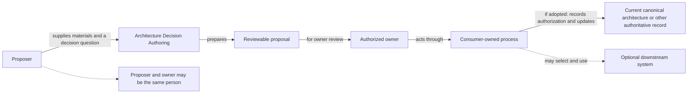
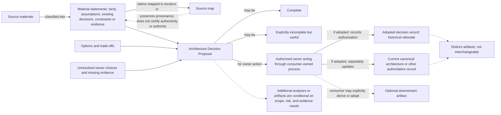
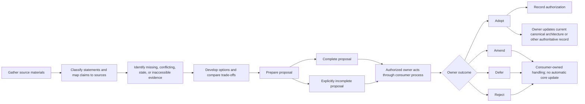

# Design views

**Status: Non-normative explanatory views.** These diagrams summarize the adopted contract; they do not add roles, requirements, artifacts, approval steps, or system components. [`docs/architecture.md`](architecture.md) governs whenever wording or diagrams differ.

## 1. Actors and responsibility boundary — who owns what?

**Governing contract:** [Purpose and boundary](architecture.md#purpose-and-boundary), [Lifecycle and adoption boundary](architecture.md#lifecycle-and-adoption-boundary), and [Downstream boundary](architecture.md#downstream-boundary).

**Material omissions:** This view is not an organizational chart and does not define reviewer roles, reporting lines, identity, or permissions. Proposer and owner are roles, not necessarily different people. Any review roles belong to the consumer's process; the core does not require a separate reviewer. The authoring core does not require downstream schemas, tools, or runtime services; the consumer chooses whether and how to hand off an adopted result.

## 2. Concepts and artifacts — what is distinct?

**Governing contract:** [Input classification and source mapping](architecture.md#input-classification-and-source-mapping), [Output contract](architecture.md#output-contract), [Lifecycle and adoption boundary](architecture.md#lifecycle-and-adoption-boundary), and [Downstream boundary](architecture.md#downstream-boundary).

**Material omissions:** This is a concept map, not a class model, schema, storage design, or exhaustive file inventory. The default proposal is Markdown-first; optional analysis artifacts are not universally required. A source map provides traceability, not proof that sources are authentic or authoritative. An adopted decision record is historical evidence and is distinct from the consumer's current canonical architecture or other authoritative record. Downstream artifacts are separately consumer-owned and optional; the authoring core does not require downstream schemas, tools, or runtime services, and the consumer chooses whether and how to hand off an adopted result.

## 3. Authoring and adoption lifecycle — where does authoring end?

**Governing contract:** [Output contract](architecture.md#output-contract) and [Lifecycle and adoption boundary](architecture.md#lifecycle-and-adoption-boundary).

**Material omissions:** The view does not prescribe a tool, approval workflow, mandatory reviewer, number of iterations, or review schedule. It does not require diagrams in individual proposals. A complete proposal and an explicitly incomplete but useful proposal are both valid outputs. The consumer's authorized owner—not the core authoring process—chooses whether to adopt, amend, defer, or reject and updates current canonical architecture or another authoritative record through the consumer's own process. Generation, commit, merge, and status labels alone are not adoption.
